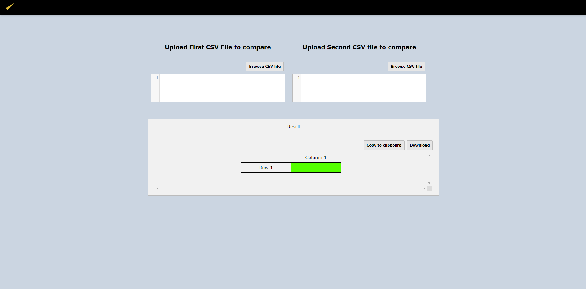

# Web CSV Diff Platform

Web CSV Diff Platform is a web-based CSV comparator written in JavaScript.
It allows to compare two CSV files.

## Credits

Credits to https://github.com/cyrilbois. Thank you.

## Launch tests

No implemented yet.

## License

MIT
